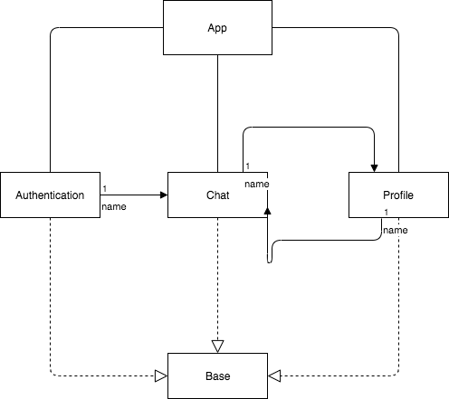

# Modular project
Apply modular for Android with navigation like diagram below

App will be breaked down into 3 module:

## Authentication
Handle all step in authentication at beginning

## Chat
All features relate to chatting

## Profile
All features relate to profile

It would be more efficient and easier for maintaining and we could user deeplink to navigate between modules.
